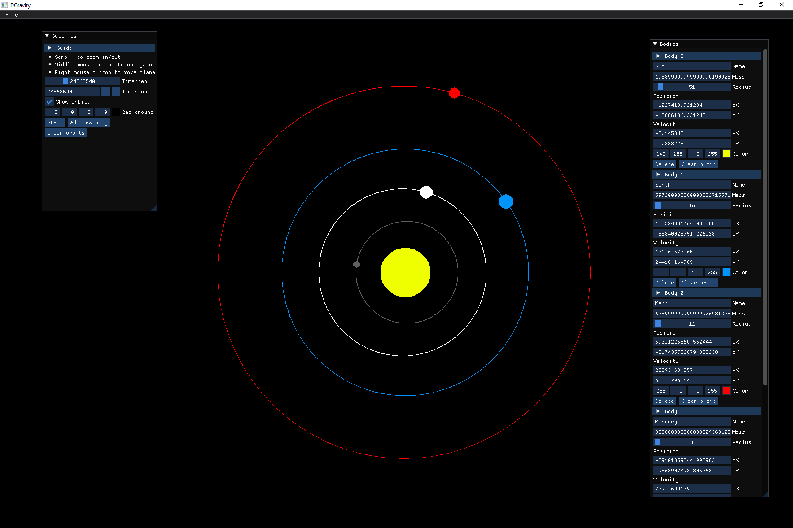

# DGravity
Gravity force simulation with SDL and ImGui

---
- Add/Delete bodies
- Configure mass, radius, position, velocity, color, etc
- Zoom in/out with scroll
- Navigate around while holding middle mouse button
- Move planets with right mouse button 
- Read from file
- Save to file
Calculations are based on [Newton's law of universal gravitaion](https://en.wikipedia.org/wiki/Gravity)

### Screenshots

